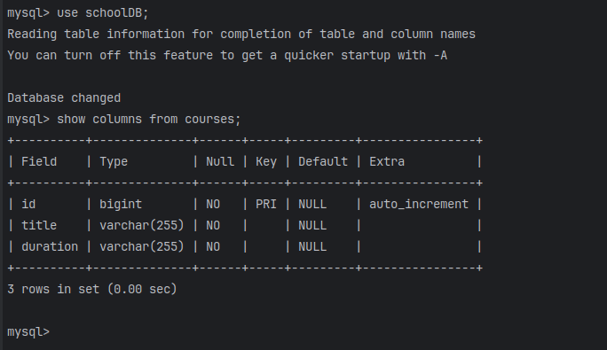
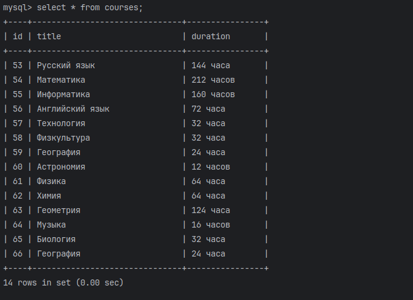
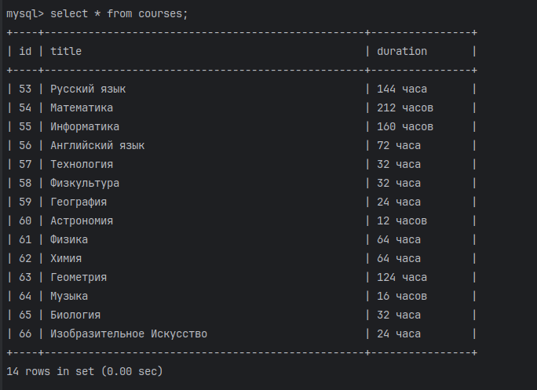
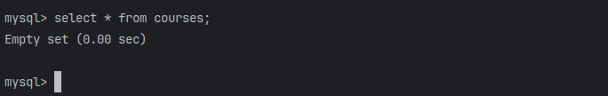

# Вывод всех столбцов в таблице 'courses':

# Вывод всех добавленных элементов с помощью методов createAll и create.

# Обновление элемента с индексом 66 через метод update

# Удаление всех элементов из БД методом delete в цикле.
